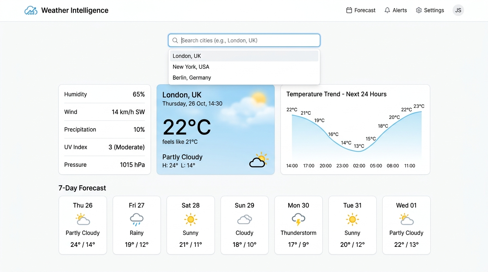
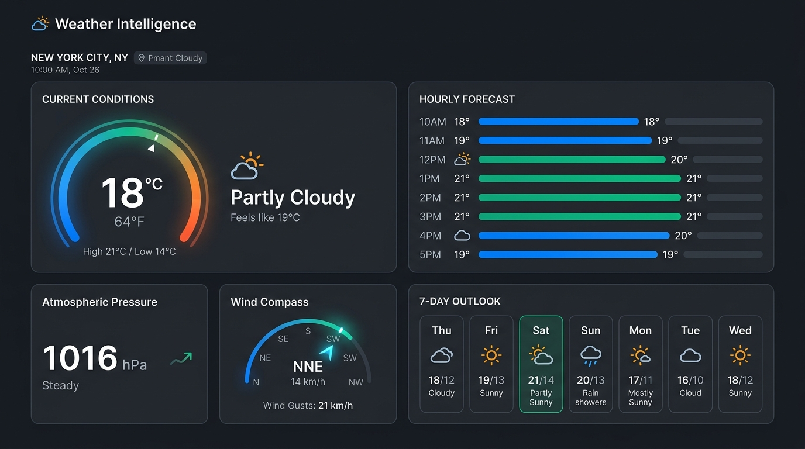
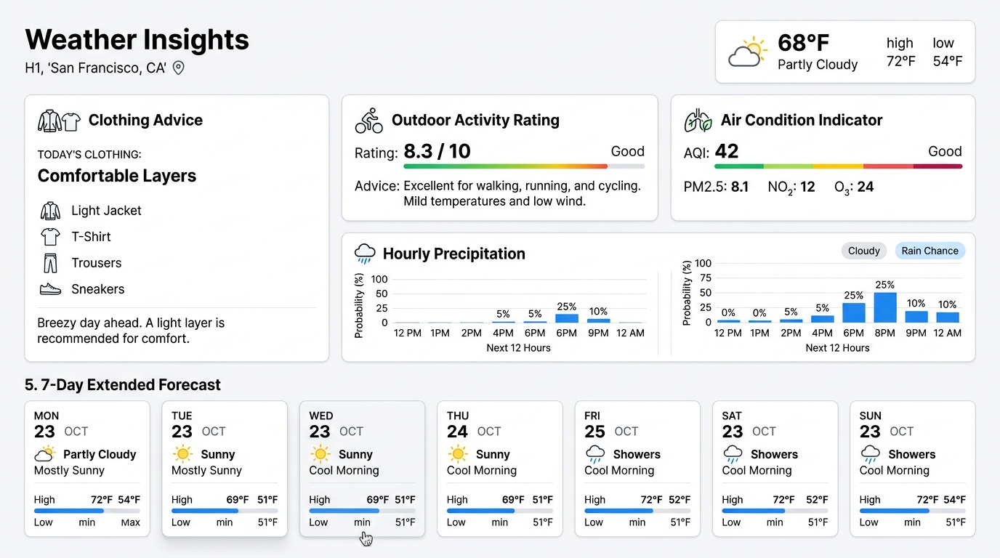

# 🌤️ Weather Intelligence

A modern, responsive, and resilient weather intelligence dashboard delivering real-time atmospheric conditions, interactive 24-hour trend visualizations, 7-day extended forecasts, and dynamic lifestyle recommendations powered by the **Open-Meteo API**.

Designed with **React 19**, **TypeScript**, **Tailwind CSS v4**, and containerized with a production-grade multi-stage **Docker** setup.

---

## 📸 Screenshots

### 1. Dashboard Overview (Light Theme)
An intuitive, high-contrast dashboard featuring current meteorological data, quick-select global city pills, and 24-hour temperature trends.

<p align="center">
  
</p>

### 2. Sleek Dark Mode Experience
Engineered with refined slate and zinc palettes for comfortable viewing in low-light environments.

<p align="center">
  
</p>

### 3. Smart Lifestyle Insights & Extended Outlook
Dynamic activity, clothing, and umbrella guidance derived from real-time meteorological metrics, alongside a comprehensive 7-day forecast.

<p align="center">
  
</p>

---

## ✨ Key Features

- **⚡ Real-Time Atmospheric Metrics**: Instant reading of temperature, feels-like temperature, humidity levels, wind speed, wind direction compass, and precipitation amounts.
- **📈 Interactive 24-Hour Trend Chart**: Smooth SVG Bézier curve visualizer showing hourly temperature progressions and humidity trends.
- **📅 7-Day Extended Forecast**: Daily highs/lows, precipitation totals, and standard WMO weather condition icons.
- **💡 Smart Lifestyle & Activity Insights**:
  - ☔ **Umbrella Advisory**: Notifies when rain or precipitation is expected today.
  - 🏃 **Outdoor Activity Index**: Rates jogging, walking, and outdoor workout viability based on heat index, humidity, and wind.
  - 👕 **Clothing Recommendation**: Suggests layering, t-shirts, rain jackets, or warm coats based on wind chill and ambient temperature.
  - 🧴 **Sun Protection & UV Guidance**: Tailored daylight tips for clear or partly cloudy conditions.
- **🔍 Global Geocoding & City Search**: Instant debounce search querying worldwide cities with fast autocomplete, plus quick-selection chips for major metropolises (London, New York, Tokyo, Paris, Sydney, Singapore, etc.).
- **📍 Current Location Detection**: Browser Geolocation API integration with automatic reverse lookups.
- **🌡️ Metric & Imperial Units**: Effortlessly switch between Celsius (°C) and Fahrenheit (°F) across all metrics.
- **🌓 Adaptive Theming**: Seamless switching between Light and Dark themes with system preference detection and persistent storage.
- **🛡️ Resilience & Offline Architecture**:
  - **Exponential Backoff Retries**: Automatically retries transient HTTP 503, 502, and 429 server errors from public upstream weather endpoints.
  - **Timezone Fallback Engine**: Bypasses heavy timezone lookups during peak server congestion.
  - **Local State Caching**: Forecasts are preserved in `localStorage`, guaranteeing instant app loading and graceful fallback during network dropouts.
  - **In-Flight Request Deduplication**: Prevents duplicate API traffic during rapid state changes.

---

## 🛠️ Technology Stack

| Layer | Technology |
|---|---|
| **Frontend Framework** | React 19 + TypeScript |
| **Styling & Design System** | Tailwind CSS v4 |
| **Bundler & Dev Server** | Vite 8 |
| **Icons** | Lucide React |
| **Animations** | Motion (`motion/react`) |
| **Weather & Geocoding API** | Open-Meteo (No API key required) |
| **Containerization** | Docker + Docker Compose + Nginx Alpine |

---

## 📁 Project Structure

```text
├── Dockerfile                 # Multi-stage production container build definition
├── docker-compose.yml         # One-command container orchestration
├── nginx.conf                 # Production SPA routing & asset caching rules
├── index.html                 # Entry HTML with meta tags
├── metadata.json              # Platform metadata & permissions
├── package.json               # Node.js dependencies and run scripts
├── tsconfig.json              # TypeScript compilation rules
├── vite.config.ts             # Vite build & Tailwind configuration
├── public/
│   └── screenshots/           # UI preview screenshots
└── src/
    ├── App.tsx                # Master state controller and layout orchestrator
    ├── main.tsx               # React application DOM entry point
    ├── index.css              # Tailwind CSS styles and theme utilities
    ├── components/
    │   ├── CurrentWeatherCard.tsx # Hero weather condition card
    │   ├── WeatherHighlights.tsx  # Grid of secondary meteorological parameters
    │   ├── WeatherChart.tsx       # 24-hour SVG temperature & humidity curve
    │   ├── ForecastGrid.tsx       # 7-day daily forecast cards
    │   ├── InsightsCard.tsx       # Lifestyle & clothing smart recommendations
    │   ├── Header.tsx             # Search bar, unit toggle, location button, theme toggle
    │   ├── WeatherIcon.tsx        # Standard WMO code to Lucide icon resolver
    │   ├── LoadingSkeleton.tsx    # Shimmer loading placeholders
    │   └── ErrorMessage.tsx       # Network error & 503 auto-retry recovery banner
    ├── services/
    │   └── weatherApi.ts          # Open-Meteo fetcher, deduplication & caching engine
    ├── types/
    │   └── weather.ts             # TypeScript interfaces and data models
    └── utils/
        ├── weatherCodes.ts        # WMO weather code definitions & descriptions
        └── recommendations.ts     # Meteorological logic for clothing & lifestyle advice
```

---

## 🚀 Getting Started (Local Development)

### Prerequisites

- **Node.js**: v20.0.0 or higher
- **npm**: v9.0.0 or higher

### Installation & Run

1. **Clone the repository**:
   ```bash
   git clone <repository-url>
   cd weather-intelligence
   ```

2. **Install dependencies**:
   ```bash
   npm install
   ```

3. **Start the local development server**:
   ```bash
   npm run dev
   ```
   The application will be running at `http://localhost:3000`.

4. **Verify TypeScript & Linting**:
   ```bash
   npm run lint
   ```

5. **Build for production**:
   ```bash
   npm run build
   ```
   The static distribution files will be generated in the `/dist` directory.

---

## 🐳 Docker Configuration & Execution

The application includes a production-ready **multi-stage Dockerfile** designed for minimal image size, high security, and optimal performance using **Nginx Alpine**.

### Architecture Overview

```text
┌─────────────────────────┐       ┌─────────────────────────┐
│   Stage 1: Builder      │       │   Stage 2: Runner       │
│   (node:22-alpine)      │──────>│   (nginx:alpine)        │
│   - npm install         │ dist/ │   - Ultra-lightweight   │
│   - npm run build       │       │   - Gzip compression    │
└─────────────────────────┘       │   - Single Page App SPA │
                                  └─────────────────────────┘
```

---

### Option 1: Run with Docker Compose (Recommended)

Docker Compose provides a single command to build and launch the container with automated health checks:

1. **Build and start the container**:
   ```bash
   docker compose up --build -d
   ```

2. **Access the application**:
   Open your browser and navigate to:
   ```text
   http://localhost:8080
   ```

3. **Check container status and logs**:
   ```bash
   # View running container status
   docker compose ps

   # View live logs
   docker compose logs -f
   ```

4. **Stop the container**:
   ```bash
   docker compose down
   ```

---

### Option 2: Run with Docker CLI

If you prefer building and running standard Docker commands without Docker Compose:

1. **Build the Docker Image**:
   ```bash
   docker build -t weather-intelligence:latest .
   ```

2. **Run the Container**:
   ```bash
   docker run -d \
     --name weather-app \
     -p 8080:80 \
     --restart unless-stopped \
     weather-intelligence:latest
   ```

3. **Access the Application**:
   Open your browser at:
   ```text
   http://localhost:8080
   ```

4. **Stop and Remove Container**:
   ```bash
   docker stop weather-app
   docker rm weather-app
   ```

---

### Customizing Ports

- To bind to port `3000` instead of `8080`:
  ```bash
  docker run -d -p 3000:80 --name weather-app weather-intelligence:latest
  ```
  Or in `docker-compose.yml`, update the `ports` mapping:
  ```yaml
  ports:
    - "3000:80"
  ```

---

### Container Health Check

The container includes a built-in healthcheck probing `/health`:
```bash
docker inspect --format='{{json .State.Health}}' weather-intelligence-app
```
Returns:
```json
{"Status":"healthy", ...}
```

---

## 🌐 External APIs & Data Reliability

Weather Intelligence uses **[Open-Meteo](https://open-meteo.com/)**:
- **Forecast Endpoint**: Provides temperature, relative humidity, wind metrics, precipitation, and WMO weather codes.
- **Geocoding Endpoint**: Global city lookup with coordinate translation.
- **Zero API Keys Required**: No authentication headers or secret keys are needed for standard non-commercial usage.
- **Rate-Limiting Protection**: The app implements request deduplication and client-side caching to maintain courteous API traffic.

---

## 📄 License

This project is licensed under the MIT License.
